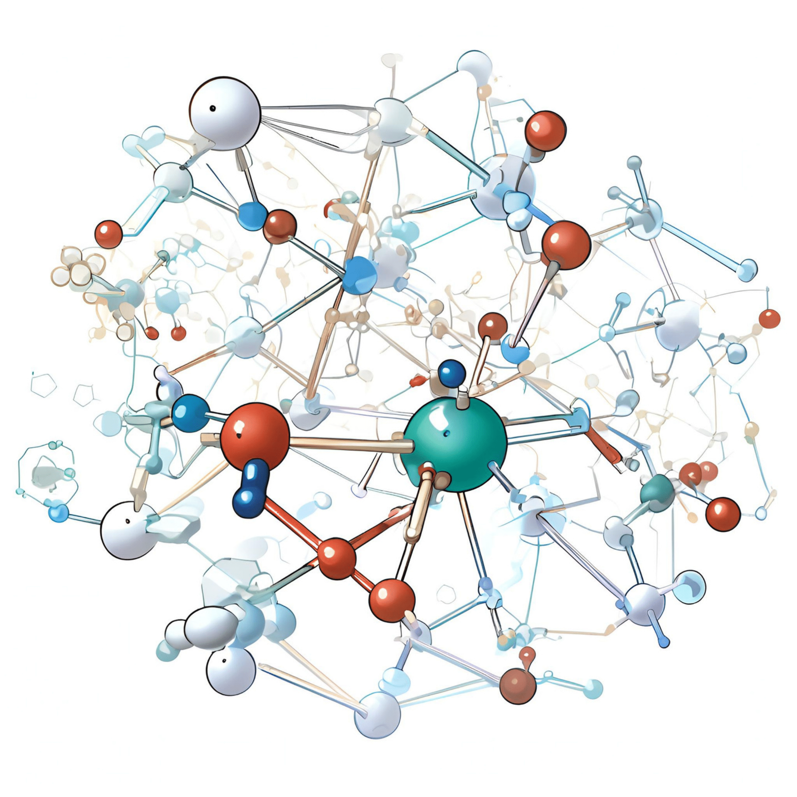
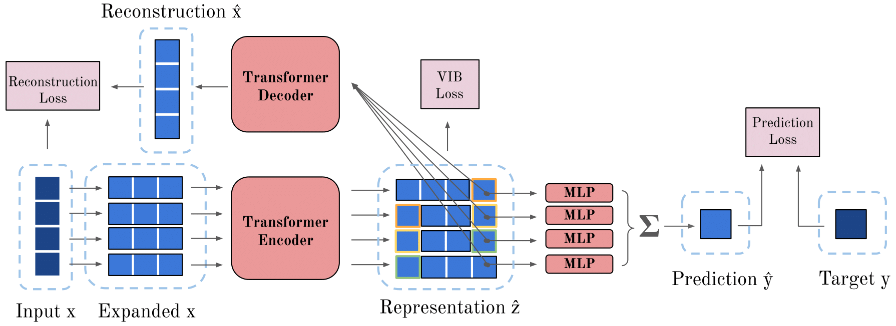

# Cliqueformer: Model-Based Optimization with Structured Transformers

This repository contains the official implementation of Cliqueformer, as described in the paper:

**Cliqueformer: Model-Based Optimization with Structured Transformers**  
Jakub Grudzien Kuba, Pieter Abbeel, Sergey Levine  
BAIR, UC Berkeley

<p align="center">
    

</p>

## Abstract

Cliqueformer is a scalable transformer-based architecture for model-based optimization (MBO) that learns the structure of the black-box function in the form of its functional graphical model (FGM). Cliqueformer demonstrates state-of-the-art performance on various tasks, from high-dimensional black-box functions to real-world chemical and genetic design problems.

<p align="center">
  
</p>

## Key Features

- Learns the structure of MBO tasks through functional graphical models
- Scalable transformer-based architecture
- Outperforms existing methods on benchmark tasks

## Installation

```bash
git clone https://github.com/znowu/cliqueformer-code.git
cd cliqueformer-code
pip install -r requirements.txt